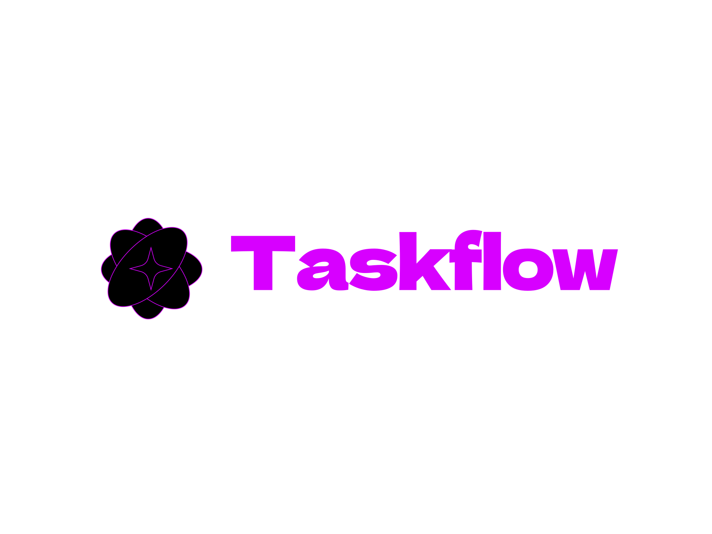

# Taskflow - The Ultimate To-Do List App

## 🚀 About Taskflow
Taskflow is a modern and intuitive to-do list web application designed to help you stay organized, boost productivity, and efficiently manage your daily tasks.

## ✨ Features
- ✅ **User-friendly Interface** - Minimalist and easy to use.
- 📌 **Task Management** - Add, edit, and delete tasks effortlessly.
- 🔔 **Reminders & Notifications** - Never forget an important task.
- 🎨 **Custom Themes** - Personalize the look of your Taskflow workspace.
- 📊 **Progress Tracking** - Stay motivated with task completion insights.

## 📂 Installation & Setup
### Prerequisites
- A web server with PHP support.
- A modern web browser.

### Steps to Run Locally
1. Download and extract the project files.
2. Move the files to your server’s root directory.
3. Ensure your server supports PHP.
4. Open your browser and visit `http://localhost/taskflow`.

## 🛠️ Technologies Used
- **Frontend:** HTML, CSS, JavaScript
- **Backend:** PHP
- **Database:** MySQL

## 💡 Future Enhancements
- 🗂️ **Categories & Tags** for better organization.
- 📅 **Calendar Integration** to sync tasks with schedules.
- 📱 **Mobile App** version for on-the-go task management.

## 📬 Contributing
We welcome contributions! Feel free to fork the repository, submit issues, or create pull requests.
